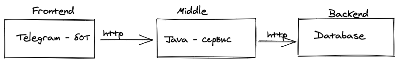

# Artemyev-Nickolay

__Разработка приложения "Мини-банк", который будет состоять из трёх компонентов:__

- frontend (telegram-bot на java/kotlin);
- middle-слой (java/kotlin-сервис);
- backend (java/kotlin-сервис).

@startuml
Customer -> Customer:money

Client -> Service: HTTP-запрос
Service -> Database: HTTP-запрос

@enduml