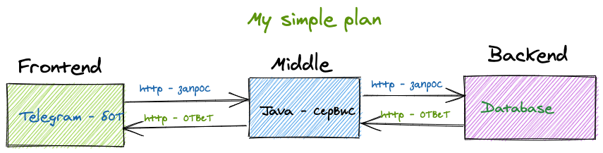

# Telegram-bot from GPB-IT-FACTORY "Мини-банк"

__Разработка приложения "Мини-банк", который будет состоять из трёх компонентов:__

- frontend (telegram-bot на java/kotlin);
- middle-слой (java/kotlin-сервис);
- backend (java/kotlin-сервис).

### Диаграмма взаимодействия сервисов

### Дальнейшие шаги по использованию сервиса...
...
### Контакты

- **Telegram:** [@nicknickart](https://t.me/nicknickart)   :blush:

